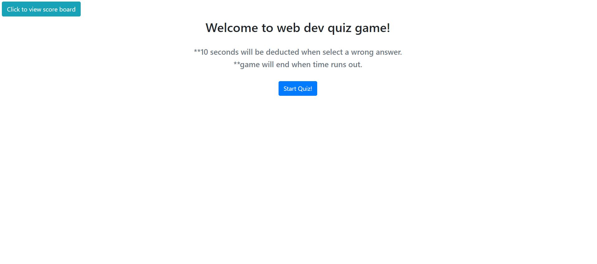
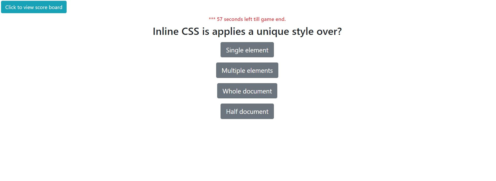
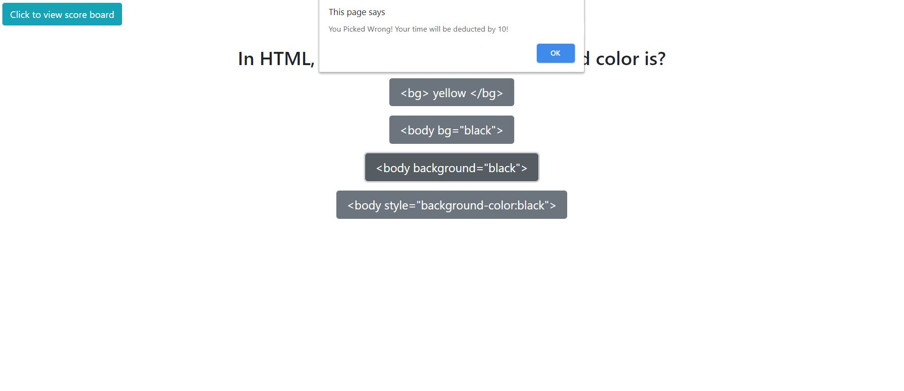
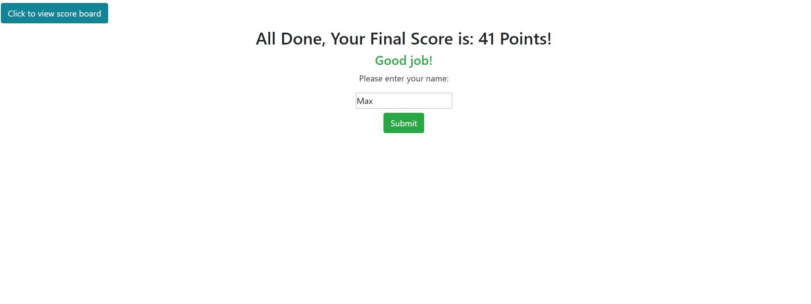
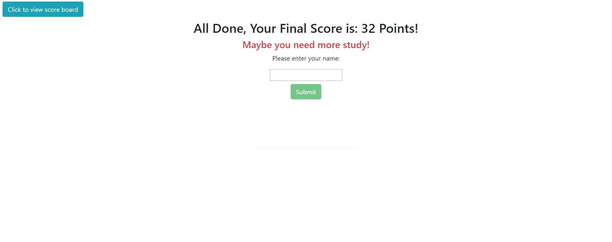
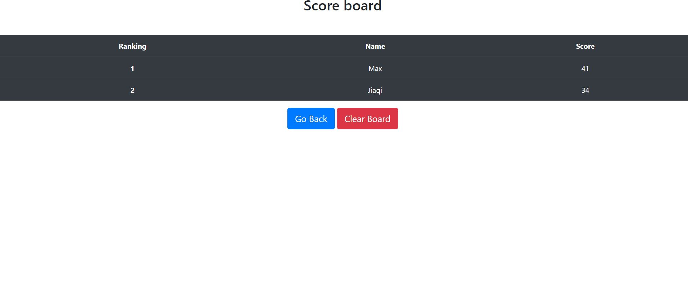

## Assignment4: Quiz Game

An application that generates timed quiz on JavaScript fundamentals and stores high scores. Scores will be added to a score board and can be viewed.
```
Below is the main screen
```


## How to use the Application

```
- when I click the start button, a timer starts and I am presented with a question

```

```
- when I answer a question, then I am presented with another question. If I make a mistake, I will be alerted and 10 seconds will be reduced.

```

```
- If all questions are answered or the timer reaches 0, the score content will display.
```
```
- If score is 40 or higher, you will receive a good comment
```

```
- If score is 39 or lower, you will receive a bad comment
```

```
- The final score with names could be viewed from a scoreboard. scoreboard will display score in sorted order, with highest score on top.
```



Website leverage bootstrap built-in responsive design and some bootstrap pre-built components.

For more infromation of bootstrap, visit: https://getbootstrap.com/ For more information of bootstrap grid and media queries, visit: https://getbootstrap.com/docs/4.4/layout/grid/


